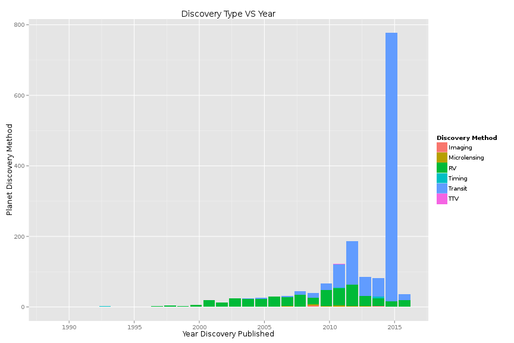
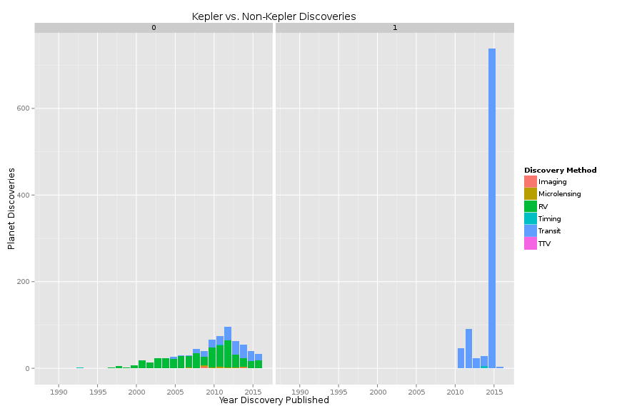
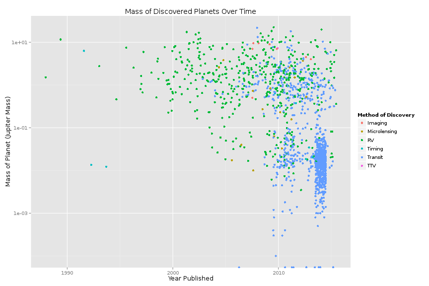
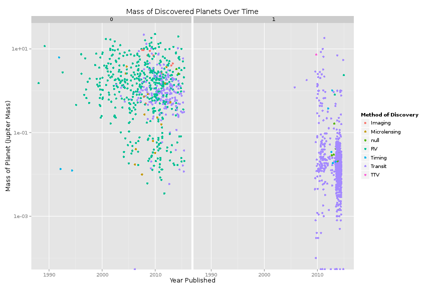
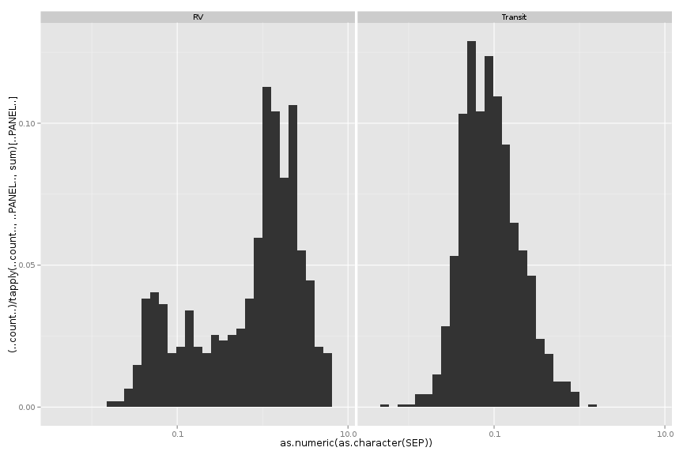
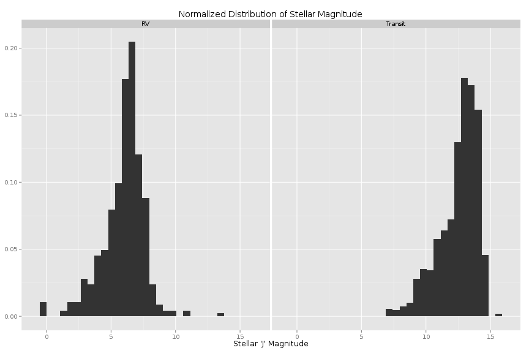

# Project 2 Documentation

## Extract, Transform, and load:

The first step in our project was to load the exoplanet data onto Oracle in a usable format.
We separated the columns into numerical and non-numerical types, using R\_ETL.R. While the majority
of the column names were well behaved, a handful were sql reserved words, and so those were renamed. Here is the relevant portion of R\_ETL.R for accomplishing this task:

```
file_path <- "./01 Data/exoplanets.csv"

df <- read.csv(file_path, stringsAsFactors = FALSE)

# Replace "." (i.e., period) with "_" in the column names.
names(df) <- gsub("\\.+", "_", names(df))
names(df)
df <- rename(df, A_0 = A)
df <- rename(df, DEC_0 = DEC)
df <- rename(df, NAME_0 = NAME)
df <- rename(df, STAR_0 = STAR)
df <- rename(df, BINARY_0 = BINARY)
df <- rename(df, DATE_0 = DATE)
df <- rename(df, DEPTH_0 = DEPTH)
df <- rename(df, H_0 = H)
df <- rename(df, I_0 = I)
df <- rename(df, K_0 = K)
df <- rename(df, PER_0 = PER)
df <- rename(df, R_0 = R)
df <- rename(df, SET_0 = SET)
df <- rename(df, TIMING_0 = TIMING)


# str(df) # Uncomment this and  run just the lines to here to get column types to use for getting the list of measures.

measures <- c("A","AUPPER","ALOWER","UA","AR","ARUPPER","ARLOWER","UAR","ASTROMETRY","B","BUPPER","BLOWER","UB","BIGOM","BIGOMUPPER","BIGOMLOWER","UBIGOM","BINARY","BMV","CHI2","DATE","DEC","DEC_STRING","DENSITY","DENSITYUPPER","DENSITYLOWER","UDENSITY","DEPTH","DEPTHUPPER","DEPTHLOWER","UDEPTH","DIST","DISTUPPER","DISTLOWER","UDIST","DR","DRUPPER","DRLOWER","UDR","DVDT","DVDTUPPER","DVDTLOWER","UDVDT","ECC","ECCUPPER","ECCLOWER","UECC","EOD","FE","FEUPPER","FELOWER","UFE","FREEZE_ECC","GAMMA","GAMMAUPPER","GAMMALOWER","UGAMMA","GL","GRAVITY","GRAVITYUPPER","GRAVITYLOWER","UGRAVITY","H","HD","HIPP","HR","I","IUPPER","ILOWER","UI","IMAGING","J","K","KUPPER","KLOWER","UK","KOI","KS","KP","LAMBDA","LAMBDAUPPER","LAMBDALOWER","ULAMBDA","LOGG","LOGGUPPER","LOGGLOWER","ULOGG","MASS","MASSUPPER","MASSLOWER","UMASS","MICROLENSING","MSINI","MSINIUPPER","MSINILOWER","UMSINI","MSTAR","MSTARUPPER","MSTARLOWER","UMSTAR","MULT","NCOMP","NOBS","OM","OMUPPER","OMLOWER","UOM","PAR","PARUPPER","PARLOWER","UPAR","PER","PERUPPER","PERLOWER","UPER","R","RUPPER","RLOWER","UR","RA","RHK","RHOSTAR","RHOSTARUPPER","RHOSTARLOWER","URHOSTAR","RMS","RR","RRUPPER","RRLOWER","URR","RSTAR","RSTARUPPER","RSTARLOWER","URSTAR","SAO","SE","SEDEPTHJ","SEDEPTHJUPPER","SEDEPTHJLOWER","USEDEPTHJ","SEDEPTHH","SEDEPTHHUPPER","SEDEPTHHLOWER","USEDEPTHH","SEDEPTHKS","SEDEPTHKSUPPER","SEDEPTHKSLOWER","USEDEPTHKS","SEDEPTHKP","SEDEPTHKPUPPER","SEDEPTHKPLOWER","USEDEPTHKP","SEDEPTH36","SEDEPTH36UPPER","SEDEPTH36LOWER","USEDEPTH36","SEDEPTH45","SEDEPTH45UPPER","SEDEPTH45LOWER","USEDEPTH45","SEDEPTH58","SEDEPTH58UPPER","SEDEPTH58LOWER","USEDEPTH58","SEDEPTH80","SEDEPTH80UPPER","SEDEPTH80LOWER","USEDEPTH80","SEP","SEPUPPER","SEPLOWER","USEP","SET","SETUPPER","SETLOWER","USET","SHK","T0","T0UPPER","T0LOWER","UT0","T14","T14UPPER","T14LOWER","UT14","TEFF","TEFFUPPER","TEFFLOWER","UTEFF","TIMING","TRANSIT","TREND","TT","TTUPPER","TTLOWER","UTT","V","VSINI","VSINIUPPER","VSINILOWER","UVSINI","KEPID","KDE")
measures[measures == "A"] <- "A_0"
measures[measures == "DEC"] <- "DEC_0"
measures[measures == "NAME"] <- "NAME_0"
measures[measures == "STAR"] <- "STAR_0"
measures[measures == "BINARY"] <- "BINARY_0" 
measures[measures == "DATE"] <- "DATE_0" 
measures[measures == "DEPTH"] <- "DEPTH_0"
measures[measures == "H"] <- "H_0"
measures[measures == "I"] <- "I_0"
measures[measures == "K"] <- "K_0"
measures[measures == "PER"] <- "PER_0"
measures[measures == "R"] <- "R_0"
measures[measures == "SET"] <- "SET_0"
measures[measures == "TIMING"] <- "TIMING_0"


```

--------------


## Data Wrangling: 

We made use of some interesting workflows in order to wrangle the data into the form needed to produce our
visualizations. Here are a representative few:

```
df2 <- df %>% select(DATE_0,MASS,PLANETDISCMETH) %>% filter(DATE_0 != NULL, MASS != NULL,PLANETDISCMETH != NULL)
```

This R workflow simply selects the desired variables, and filters out rows containing null entries that would be problematic to the visualization.

```
discoveryTypeYearDF <- df%>% filter(PLANETDISCMETH != "null", DATE_0 != "null") %>%
  group_by(DATE_0, PLANETDISCMETH) %>%
  summarise(discoveryCount = length(PLANETDISCMETH))
```

This more complicated workflow is used in order to produce a bar plot. It first filters out null rows that would cause problems, groups the data by date and planet discovery method, then creates a summary column counting the number of planet discoveries.

```
keplerDiscoveriesDF <- df %>% filter (DATE_0 != 'null', PLANETDISCMETH != 'null') %>%
  group_by(DATE_0, KDE,PLANETDISCMETH) %>% summarise(discoveryCount = length(KDE)) %>% arrange(DATE_0)
```

This workflow is similar to the last, but also groups by KDE (whether or not the planet is contained in the Keppler archive), and sorts the data by date.

--------------

## Results
Our aim in analyzing the exoplanets dataset was to compare the different methods of detecting exoplanets
in order to see how each planet detection method is used.

To get a good overview, we started with a simple barchart showing the number of planet discoveries over time, grouped into the different discovery methods


```r
source("../02\ Data\ Wrangling/discmethods.R",echo=TRUE)
```

```
## 
## > #df <- data.frame(fromJSON(getURL(URLencode('129.152.144.84:5001/rest/native/?query="SELECT * from EXOPLANETS"'),httpheader=c(DB='jdbc:oracle:thin:@ .... [TRUNCATED] 
## 
## > ggplot(discoveryTypeYearDF, aes(x=as.Date(DATE_0, format = '%Y'),y=discoveryCount,fill=PLANETDISCMETH))+
## +   geom_bar(stat="identity")+
## + labs(title .... [TRUNCATED]
```

 

looking at this chart, we can see that, by far, the two most common discovery methods for planets
are RV (Radial Velocity) and Transit.

In 2009, the Kepler Space Observator entered service. Since then, it has been one of the most
effective tools for discovery exoplanets of all time. It might be useful, then, to separate
the Keppler data from the rest:


```r
source("../02\ Data\ Wrangling/keplerFacets.R",echo=TRUE)
```

```
## 
## > #df <- data.frame(fromJSON(getURL(URLencode('129.152.144.84:5001/rest/native/?query="SELECT * from EXOPLANETS"'),httpheader=c(DB='jdbc:oracle:thin:@ .... [TRUNCATED] 
## 
## > ggplot(keplerDiscoveriesDF, aes(x=as.Date(DATE_0, format = '%Y'),y=discoveryCount,fill=PLANETDISCMETH))+
## +   geom_bar(stat="identity")+
## +   labs(tit .... [TRUNCATED]
```

 

So it seems most of all recent exoplanet discoveries (particularly those made via the Transit method) were 
discovered by Kepler.

Next we thought it might be useful to see how discovery methods over time have an impact on what mass
of planet we find.


```r
source("../02\ Data\ Wrangling/massDate.R",echo=TRUE)
```

```
## 
## > #df <- data.frame(fromJSON(getURL(URLencode('129.152.144.84:5001/rest/native/?query="select * from EXOPLANETS"'),httpheader=c(DB='jdbc:oracle:thin:@ .... [TRUNCATED] 
## 
## > require(extrafont)
## 
## > ggplot() +
## +   coord_cartesian() + 
## +   scale_x_continuous() +
## +   scale_y_log10() +
## +   labs(title="Mass of Discovered Planets Over Time",y="Mass o ..." ... [TRUNCATED]
```

 

A very interesting result. From this plot, we can see that it is only in recent years that we have been able to discover such low-mass planets. We can also separate this data into kepler/non kepler subsets:


```r
source("../02\ Data\ Wrangling/massDateKepler.R",echo=TRUE)
```

```
## 
## > require(extrafont)
## 
## > #df <- data.frame(fromJSON(getURL(URLencode('129.152.144.84:5001/rest/native/?query="select * from EXOPLANETS"'),httpheader=c(DB='jdbc:oracle:thin:@ .... [TRUNCATED] 
## 
## > ggplot() +
## +   coord_cartesian() + 
## +   scale_x_continuous() +
## +   scale_y_log10() +
## +   labs(title="Mass of Discovered Planets Over Time",y="Mass o ..." ... [TRUNCATED]
```

```
## Warning: NAs introduced by coercion
```

```
## Warning: NAs introduced by coercion
```

```
## Warning: Removed 1 rows containing missing values (geom_point).
```

```
## Warning: Removed 3786 rows containing missing values (geom_point).
```

 

Here we can see that this is true even excluding kepler data. That is, in recent years, RV has also become 
more capable of discovering lower mass planets.

Another planetary parameter we looked at was the separation between the planet and its star:


```r
source("../02\ Data\ Wrangling/sep.R",echo=TRUE)
```

```
## 
## > require(extrafont)
## 
## > #df <- data.frame(fromJSON(getURL(URLencode('129.152.144.84:5001/rest/native/?query="select * from EXOPLANETS"'),httpheader=c(DB='jdbc:oracle:thin:@ .... [TRUNCATED] 
## 
## > ggplot(df2, aes(x=as.numeric(as.character(SEP))))+
## +   facet_grid(. ~ PLANETDISCMETH) +
## +   geom_histogram(aes(y=(..count..)/tapply(..count..,..PANE .... [TRUNCATED]
```

```
## stat_bin: binwidth defaulted to range/30. Use 'binwidth = x' to adjust this.
## stat_bin: binwidth defaulted to range/30. Use 'binwidth = x' to adjust this.
```

 

```
## 
## >   labs(title="Distribution of Stellar Magnitude",x="Separation (AU)",y="dist")
## $title
## [1] "Distribution of Stellar Magnitude"
## 
## $x
## [1] "Separation (AU)"
## 
## $y
## [1] "dist"
## 
## attr(,"class")
## [1] "labels"
```

This pair of histograms compares the distribution of planetary distances for Transit and Radial Velocity 
discovery methods. From this data we can see that the Transit method is much better suited for planets
much closer to their stars, while RV is typically used for finding planets further away.

Lastly, we compared the two main discovery methods by stellar 2MASS J magnitude.


```r
source("../02\ Data\ Wrangling/Jmag.R",echo=TRUE)
```

```
## 
## > require(extrafont)
## 
## > #df <- data.frame(fromJSON(getURL(URLencode('129.152.144.84:5001/rest/native/?query="select * from EXOPLANETS"'),httpheader=c(DB='jdbc:oracle:thin:@ .... [TRUNCATED] 
## 
## > ggplot(df2, aes(x=as.numeric(as.character(J))))+
## +   facet_grid(. ~ PLANETDISCMETH) +
## +   geom_histogram(aes(y=(..count..)/tapply(..count..,..PANEL. .... [TRUNCATED]
```

```
## stat_bin: binwidth defaulted to range/30. Use 'binwidth = x' to adjust this.
## stat_bin: binwidth defaulted to range/30. Use 'binwidth = x' to adjust this.
```

 

This plot shows that the transit method tends to be used on stars with a higher stellar magnitude, 
compared to radial velocity. This makes
sense considering that transit photometry works by detecting variations in a star's magnitude as the planet
passes in front of it.


